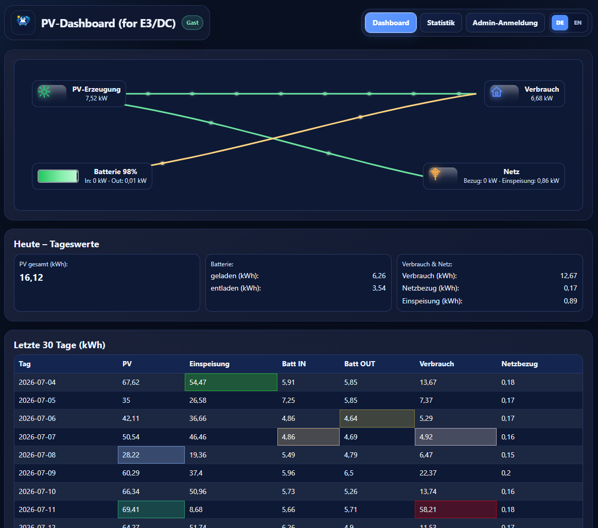
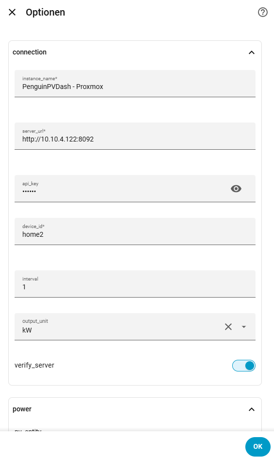
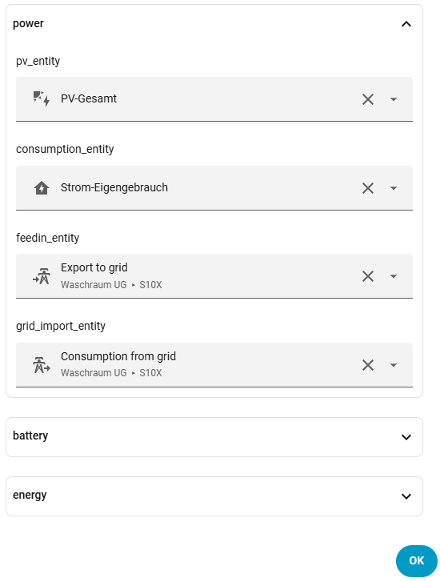

# PenguinPVDash

PenguinPVDash is a Home Assistant extension that publishes selected PV and energy sensors to an external dashboard. It is especially useful for E3/DC systems and other battery-based installations: live energy flow, longer history, statistics and an optional read-only guest view are available without exposing Home Assistant itself.



## Home Assistant integration via HACS

1. Open **HACS → Integrations → Custom repositories**.
2. Add `https://github.com/Borderlane-HA/PenguinPVDash` as category **Integration**.
3. Install PenguinPVDash and restart Home Assistant.
4. Open **Settings → Devices & services → Add integration → PenguinPVDash**.
5. Enter the server address (for example `http://10.10.4.122:8092`), the matching API key, device ID and your PV sensors. The integration adds `/api/ingest.php` automatically and can test the connection without writing measurement data.

Multiple server entries are supported and can be edited later.

## Docker

```bash
git clone https://github.com/Borderlane-HA/PenguinPVDash.git
cd PenguinPVDash
cp .env.example .env
nano .env
docker compose up -d
```

Default URL: `http://SERVER-IP:8092`

Update:

```bash
cd PenguinPVDash
docker compose pull
docker compose up -d
```

Persistent data is stored in `./data`.

## Proxmox VE

Run on the Proxmox host as `root`:

```bash
bash -c "$(curl -fsSL https://raw.githubusercontent.com/Borderlane-HA/PenguinPVDash/main/scripts/proxmox-lxc-install.sh)"
```

The installer creates an unprivileged Debian LXC with Docker and asks for network, VLAN, passwords, guest permissions, device ID, API key and feed-in compensation. Values such as `7.5` and `7,5` are accepted for ct/kWh.

Update inside the created LXC:

```bash
cd /opt/penguinpvdash
docker compose pull
docker compose up -d
```

## Administration

The admin area provides data correction, device-ID management, SQLite import/export and backups, API-key and password settings, guest permissions, themes, dashboard language, custom branding and statistics. Guests are read-only.

PenguinPVDash is under active development. Feedback and issue reports are welcome.




