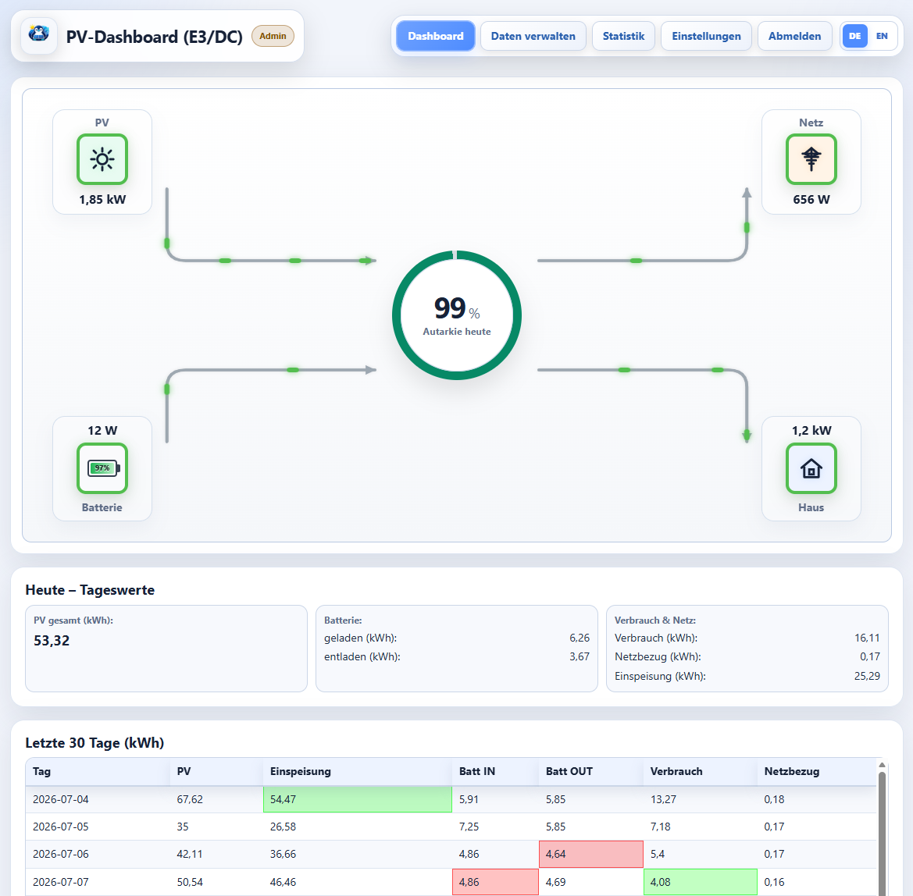

# PenguinPVDash

PenguinPVDash is a Home Assistant extension that publishes selected PV and energy sensors to an external dashboard. It is especially useful for E3/DC systems and other battery-based installations: live energy flow, longer history, statistics and an optional read-only guest view are available without exposing Home Assistant itself.




## Home Assistant integration via HACS

Deploy the Docker or Proxmox server first so Home Assistant can verify the connection during setup.

1. Open **HACS → Integrations → Custom repositories**.
2. Add `https://github.com/Borderlane-HA/PenguinPVDash` as category **Integration**.
3. Install PenguinPVDash and restart Home Assistant.
4. Open **Settings → Devices & services → Add integration → PenguinPVDash**.
5. Enter the server address (for example `http://10.10.4.122:8092`), matching API key and device ID. Clicking **Next** verifies the server without writing measurement data. After a successful check, assign the PV, grid and battery sensors. The integration adds `/api/ingest.php` automatically.

Multiple server entries are supported and can be edited later.

## Docker

```bash
git clone https://github.com/Borderlane-HA/PenguinPVDash.git
cd PenguinPVDash
cp .env.example .env
nano .env
docker compose up -d
```

Default URL: `http://SERVER-IP:8092`

Update:

```bash
cd PenguinPVDash
docker compose pull
docker compose up -d
```

Persistent data is stored in `./data`.

## Proxmox VE

Run on the Proxmox host as `root`:

```bash
bash -c "$(curl -fsSL https://raw.githubusercontent.com/Borderlane-HA/PenguinPVDash/main/scripts/proxmox-lxc-install.sh)"
```

The installer creates an unprivileged Debian LXC with Docker and asks for network, VLAN, passwords, guest permissions, device ID, API key and feed-in compensation. Values such as `7.5` and `7,5` are accepted for ct/kWh.

Update inside the created LXC:

```bash
cd /opt/penguinpvdash
docker compose pull
docker compose up -d
```

## Administration

The admin area provides data correction, device-ID management, SQLite import/export and backups, API-key and password settings, guest permissions, themes, dashboard language, custom branding and statistics. The statistics area includes general, battery, autonomy and self-consumption analysis with selectable date ranges and charts. The classic energy-flow diagram remains available alongside a new modern design. Guests are read-only.

PenguinPVDash is under active development. Feedback and issue reports are welcome.


## Home Assistant field reference

### Instance & server

| Field | What to enter |
|---|---|
| **Name of this instance** | Any descriptive name, for example `Home PV` or `Test server`. |
| **PenguinPVDash server address** | Only the base address is required, for example `http://10.10.4.122:8092`. The integration adds `/api/ingest.php` automatically. |
| **API key** | The API key configured for this device ID on the PenguinPVDash server. |
| **Device ID / data-source ID** | A unique ID such as `home` or `home2`. It must match the device ID configured on the server. |
| **Transmission interval** | How often data is sent. `1` minute is recommended. |
| **Unit of the live power sensors** | Select `W` or `kW` according to the live sensors configured below. All live power sensors should use the same unit. |

The initial setup always checks the server before the sensor step opens. Later, changes to the server address, device ID or API key are checked automatically before they are saved. Sensor-only changes do not require the server to be online.

### Live power: PV, home & grid

| Field | Recommended sensor |
|---|---|
| **Current PV generation power** | Current total PV output. Combine all PV systems first if more than one system is installed. |
| **Current whole-home consumption power** | Current total household consumption. For an additional balcony PV system, use a Home Assistant template sensor that already includes it. |
| **Current grid export power** | Current power exported to the public grid. |
| **Current grid import power** | Current power imported from the public grid. |

### Battery storage

These fields are optional when no battery is installed.

| Field | Recommended sensor |
|---|---|
| **Battery state of charge (SoC)** | Current battery charge level in percent. |
| **Current battery charging power** | Current power flowing into the battery. Use a positive value while charging. |
| **Current battery discharging power** | Current power supplied by the battery. Use a positive value while discharging. |

### Daily values for history & statistics

Use sensors in **kWh** that show the value for the current day. Do not select lifetime energy meters. The values should reset daily or otherwise represent “today”.

| Field | Recommended sensor |
|---|---|
| **PV generation today** | Total PV energy generated today, including all PV systems. |
| **Whole-home consumption today** | Total household consumption today. PenguinPVDash does not calculate this value on the server. |
| **Grid export today** | Energy exported to the public grid today. |
| **Grid import today** | Energy imported from the public grid today. |
| **Battery charged today** | Energy charged into the battery today. |
| **Battery discharged today** | Energy discharged from the battery today. |
